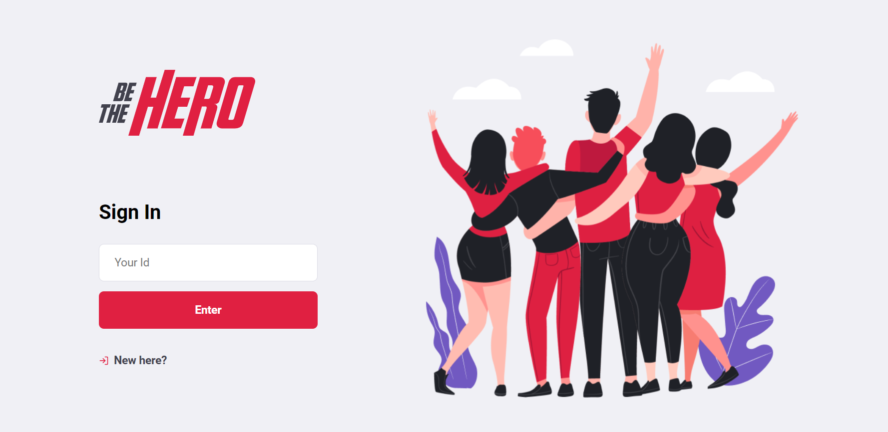

<h1 align="center">
    
</h1>

<h4 align="center"> 
	:construction: 🚀 Semana OmniStack 11.0 In progress.. :construction:
</h4>

  <a href="#rocket-Technologies">Technologies</a>&nbsp;&nbsp;&nbsp;|&nbsp;&nbsp;&nbsp;
  <a href="#-project">Project</a>&nbsp;&nbsp;&nbsp;|&nbsp;&nbsp;&nbsp;
  <a href="#-layout">Layout</a>&nbsp;&nbsp;&nbsp;|&nbsp;&nbsp;&nbsp;
  <a href="#-how-to-contribute">How to contribute</a>&nbsp;&nbsp;&nbsp;|&nbsp;&nbsp;&nbsp;

  </a>

 

## :rocket: Technologies

This project was developed with the following technologies:

- [Node.js](https://nodejs.org/en/) 
- [React](https://reactjs.org) 
- [React Native](https://facebook.github.io/react-native/)
- [Expo](https://expo.io/) in coming :construction:

## 💻 Project

Be The Hero is a project that aims to connect people who are willing to help ONGs.

## 🔖 Layout

   </a>

## 🤔 How to contribute

- Make a fork;
- Create a branck with your feature: `git checkout -b my-feature`;
- Commit changes: `git commit -m 'feat: My new feature'`;
- Make a push to your branch: `git push origin my-feature`.

After merging your receipt request to done, you can delete a branch from yours.

---

Made with Isaque Igor :wave: [Get in touch!](https://www.linkedin.com/in/isaqueigor/)
